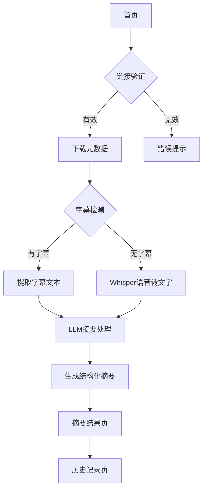

## 1. 产品概述
YouTube视频摘要工具是一个自动化内容处理平台，帮助用户快速获取长视频的核心信息。用户只需提供YouTube链接，系统即可生成结构化的中文摘要，节省观看时间并提高信息获取效率。

该产品主要解决长视频内容消费效率低下的问题，适用于学生、研究人员、内容创作者等需要快速了解视频内容的用户群体。

## 2. 核心功能

### 2.1 用户角色
| 角色 | 注册方式 | 核心权限 |
|------|----------|----------|
| 普通用户 | 邮箱注册 | 提交视频链接、查看摘要历史、下载摘要 |
| 高级用户 | 付费升级 | 批量处理、API访问、优先处理队列 |

### 2.2 功能模块
产品包含以下核心页面：
1. **首页**：视频链接输入、处理状态展示、示例展示
2. **摘要结果页**：结构化摘要展示、元信息显示、章节内容
3. **历史记录页**：过往摘要列表、搜索筛选、重新处理

### 2.3 页面详情
| 页面名称 | 模块名称 | 功能描述 |
|----------|----------|----------|
| 首页 | 链接输入区 | 接收用户输入的YouTube链接，支持粘贴和拖拽 |
| 首页 | 处理状态 | 实时显示视频处理进度（下载、转录、摘要生成） |
| 首页 | 示例展示 | 展示热门视频摘要样例，帮助用户了解输出格式 |
| 摘要结果页 | 视频元信息 | 显示标题、作者、时长、发布日期等基础信息 |
| 摘要结果页 | 章节摘要 | 按视频章节分段展示内容摘要 |
| 摘要结果页 | 关键要点 | 提取核心观点、重要数据、关键结论 |
| 摘要结果页 | 术语解释 | 对专业术语提供简要中文解释 |
| 摘要结果页 | 导出功能 | 支持PDF、Markdown格式导出 |
| 历史记录页 | 摘要列表 | 展示用户所有处理过的视频摘要 |
| 历史记录页 | 搜索筛选 | 按关键词、日期、时长等条件筛选 |
| 历史记录页 | 重新处理 | 支持对已有摘要进行重新分析和优化 |

## 3. 核心流程
用户操作流程如下：
1. 用户在首页输入YouTube视频链接
2. 系统验证链接有效性，开始下载视频元数据
3. 优先尝试获取官方字幕，无字幕时使用Whisper进行语音转文字
4. 将获得的文本内容发送给LLM进行中文摘要处理
5. 生成包含章节、关键要点、术语解释的结构化摘要
6. 展示结果页面，用户可查看、编辑、导出摘要内容

## 4. 用户界面设计

### 4.1 设计风格
- **主色调**：深蓝色 (#1E40AF) 搭配白色背景
- **按钮样式**：圆角矩形，悬停效果，主要操作为实心按钮
- **字体**：中文使用思源黑体，英文使用Inter，正文字号14-16px
- **布局风格**：卡片式布局，左侧内容区域，右侧辅助信息
- **图标风格**：使用简洁的线性图标，保持视觉一致性

### 4.2 页面设计概述
| 页面名称 | 模块名称 | UI元素 |
|----------|----------|--------|
| 首页 | 链接输入区 | 大尺寸输入框，占位符文字提示支持格式，粘贴按钮 |
| 首页 | 处理进度 | 进度条配合百分比显示，步骤说明文字，预计剩余时间 |
| 摘要结果页 | 视频信息卡片 | 缩略图、标题、作者头像、统计信息网格布局 |
| 摘要结果页 | 章节内容 | 手风琴式折叠面板，章节标题和时间戳，内容区域 |
| 摘要结果页 | 关键要点 | 高亮卡片设计，图标配合要点标题，简洁描述文字 |
| 历史记录页 | 记录列表 | 时间线式设计，缩略图+标题+处理时间组合 |

### 4.3 响应式设计
采用桌面端优先设计，适配1200px以上大屏幕为主。移动端适配包括：
- 单列布局，重要功能置底固定
- 触摸优化：增大点击区域，支持滑动操作
- 字体自适应：根据屏幕尺寸调整字号
- 横竖屏适配：保持核心功能可见性