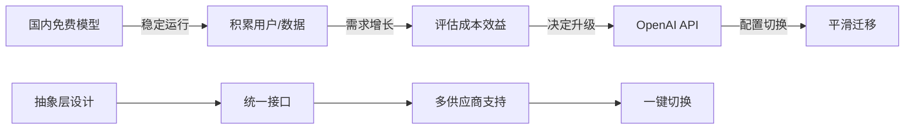

# 项目技术架构方案确认文档

## 1. 数据库兼容性处理方案

### 1.1 Supabase集成方案（推荐）

**技术选择理由：**

* 云端PostgreSQL，零本地安装需求

* 内置认证、存储、实时功能

* 免费额度充足，适合项目初期

**集成步骤：**

```
步骤1：注册Supabase账号
- 访问 https://supabase.com
- 使用GitHub账号快速注册

步骤2：创建新项目
- 点击"New Project"
- 设置项目名称和密码
- 选择地区（推荐Asia Pacific）

步骤3：获取连接信息
- 进入项目Dashboard
- 点击左侧"Settings" → "API"
- 复制以下信息：
  * Project URL
  * anon/public key
  * service_role key（后端使用）

步骤4：环境变量配置
# .env文件
VITE_SUPABASE_URL=your_project_url
VITE_SUPABASE_ANON_KEY=your_anon_key
SUPABASE_SERVICE_KEY=your_service_key（仅后端）

步骤5：安装依赖
npm install @supabase/supabase-js

步骤6：初始化客户端
// supabase.js
import { createClient } from '@supabase/supabase-js'
const supabase = createClient(
  import.meta.env.VITE_SUPABASE_URL,
  import.meta.env.VITE_SUPABASE_ANON_KEY
)
```

**兼容性要求：**

* 网络要求：需要稳定的互联网连接

* 浏览器支持：现代浏览器（ES6+）

* Node.js版本：≥14.0.0

* 无需本地PostgreSQL安装

### 1.2 本地开发替代方案：SQLite

**适用场景：**

* 无网络环境开发

* 快速原型验证

* 数据敏感性要求

**技术方案：**

```
技术栈选择：
- Node.js + better-sqlite3（同步操作）
- 或 Prisma + SQLite（推荐，支持迁移）

实施步骤：
1. 安装Prisma CLI：npm install prisma -D
2. 初始化：npx prisma init --datasource-provider sqlite
3. 定义数据模型（schema.prisma）
4. 迁移数据库：npx prisma migrate dev
5. 生成客户端：npx prisma generate
```

**SQLite vs Supabase对比：**

| 特性    | SQLite | Supabase    |
| ----- | ------ | ----------- |
| 安装复杂度 | 零安装    | 需注册账号       |
| 数据持久性 | 本地文件   | 云端自动备份      |
| 扩展性   | 单机限制   | 自动扩展        |
| 认证功能  | 需自建    | 内置完整认证      |
| 实时功能  | 无      | 内置WebSocket |
| 成本    | 免费     | 免费额度充足      |

### 1.3 MySQL适配评估

**不推荐原因：**

* 需要本地安装配置

* 无Serverless优势

* 与Supabase生态不兼容

* 增加运维复杂度

**结论：** 优先使用Supabase，本地开发可用SQLite过渡

***

## 2. AI服务替代方案

### 2.1 国内免费AI模型对比分析

**技术参数对比表：**

| 模型名称        | 提供商  | 上下文长度 | 输入价格    | 输出价格    | 免费额度       | 技术特点     |
| ----------- | ---- | ----- | ------- | ------- | ---------- | -------- |
| DeepSeek V3 | 深度求索 | 128K  | ￥0.5/1K | ￥1.5/1K | 500万tokens | 开源，代码能力强 |
| Qwen 2.5    | 阿里云  | 128K  | ￥0.3/1K | ￥0.6/1K | 100万tokens | 中文优化好    |
| Moonshot V1 | 月之暗面 | 200K  | ￥0.6/1K | ￥1.8/1K | 50万tokens  | 长文本处理优秀  |
| GLM-4       | 智谱AI | 128K  | ￥0.5/1K | ￥0.5/1K | 500万tokens | 多模态支持    |

**推荐方案：** DeepSeek V3（综合性价比最优）

### 2.2 国内AI模型API接入指南

**DeepSeek API接入示例：**

```javascript
// 统一的LLM服务接口
class LLMService {
  constructor(provider, apiKey, baseURL) {
    this.provider = provider;
    this.apiKey = apiKey;
    this.baseURL = baseURL;
  }

  async chat(messages, model = 'deepseek-chat') {
    const response = await fetch(`${this.baseURL}/chat/completions`, {
      method: 'POST',
      headers: {
        'Content-Type': 'application/json',
        'Authorization': `Bearer ${this.apiKey}`
      },
      body: JSON.stringify({
        model: model,
        messages: messages,
        temperature: 0.7,
        max_tokens: 2000
      })
    });
    
    return await response.json();
  }
}

// 使用示例
const deepseek = new LLMService(
  'deepseek',
  process.env.DEEPSEEK_API_KEY,
  'https://api.deepseek.com/v1'
);
```

**各平台API文档：**

* DeepSeek: <https://platform.deepseek.com/docs>

* Qwen: <https://help.aliyun.com/document_detail/2712576.html>

* Moonshot: <https://platform.moonshot.cn/docs>

### 2.3 Trae会员服务说明

**当前权限（免费版）：**

* 基础代码补全

* 单文件编辑

* 基础问答功能

**会员版功能（推测）：**

* 多文件同时编辑

* 高级代码重构

* 项目级理解

* 优先响应速度

**建议：** 初期使用免费版足够，后续根据需求升级

### 2.4 过渡期技术方案

**迁移路径设计：**



**迁移实施步骤：**

1. **阶段一（当前）**：使用DeepSeek等国内API
2. **阶段二（3-6个月后）**：评估使用量和成本
3. **阶段三（需要时）**：通过配置切换至OpenAI

**配置化迁移方案：**

```javascript
// config/llm.js
export const LLM_CONFIG = {
  // 国内方案（当前）
  current: {
    provider: 'deepseek',
    apiKey: process.env.DEEPSEEK_API_KEY,
    baseURL: 'https://api.deepseek.com/v1',
    model: 'deepseek-chat'
  },
  
  // OpenAI方案（备用）
  openai: {
    provider: 'openai',
    apiKey: process.env.OPENAI_API_KEY,
    baseURL: 'https://api.openai.com/v1',
    model: 'gpt-3.5-turbo'
  }
};
```

***

## 3. 可行性分析与风险评估

### 3.1 技术可行性分析

**数据库方案：**

* ✅ Supabase：技术成熟，文档完善，社区活跃

* ✅ SQLite：轻量级，零配置，适合本地开发

* ⚠️ 网络依赖：需要稳定的互联网连接

**AI服务方案：**

* ✅ 国内API：接入简单，成本低廉，性能充足

* ✅ 抽象层设计：支持多供应商切换

* ⚠️ 政策风险：需关注API服务稳定性

### 3.2 风险评估与应对

| 风险类型 | 风险描述          | 影响程度 | 应对措施                               |
| ---- | ------------- | ---- | ---------------------------------- |
| 技术风险 | Supabase服务不可用 | 高    | 1. 定期数据备份2. SQLite本地备份方案3. 多云服务商备选 |
| 成本风险 | AI API费用超预算   | 中    | 1. 设置API调用限额2. 缓存常用请求3. 用户分级策略     |
| 政策风险 | 国内API服务调整     | 中    | 1. 多供应商接入2. 抽象层设计3. OpenAI备选方案     |
| 性能风险 | 响应时间过长        | 低    | 1. 前端加载优化2. 缓存策略3. CDN加速           |

### 3.3 时间节点与交付物

**第一阶段（1-2周）：基础架构搭建**

* ✅ Supabase集成完成

* ✅ 基础用户认证

* ✅ SQLite本地开发环境

* 📋 交付物：技术架构文档、环境配置说明

**第二阶段（2-3周）：AI服务集成**

* ✅ DeepSeek API接入

* ✅ LLM抽象层实现

* ✅ 基础对话功能

* 📋 交付物：API集成文档、测试报告

**第三阶段（1周）：文档与培训**

* ✅ 技术文档整理

* ✅ 运维手册编写

* ✅ 开发规范制定

* 📋 交付物：完整技术文档、操作手册

### 3.4 技术文档清单

**必需文档：**

1. 《Supabase集成操作手册》
2. 《AI服务API接入指南》
3. 《数据库设计文档》
4. 《环境配置说明》
5. 《部署运维手册》

**文档标准：**

* 步骤清晰，截图完整

* 包含常见问题解答

* 提供故障排查指南

* 定期更新维护

***

## 4. 总结与建议

**推荐技术方案：**

1. **数据库**：优先使用Supabase，本地开发用SQLite
2. **AI服务**：从DeepSeek开始，通过抽象层支持后续切换
3. **开发模式**：小步快跑，快速验证，逐步优化

**下一步行动：**

1. 立即注册Supabase账号并创建项目
2. 申请DeepSeek API密钥
3. 搭建基础项目框架
4. 实现MVP功能验证

**关键成功因素：**

* 保持架构简单可扩展

* 做好服务抽象和解耦

* 重视文档和测试

* 关注用户反馈快速迭代

