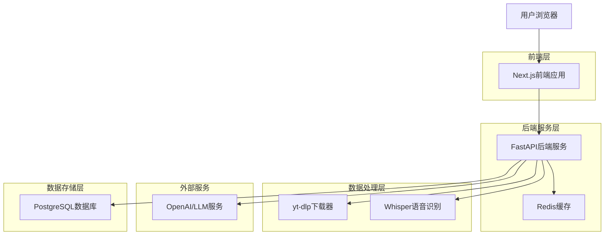
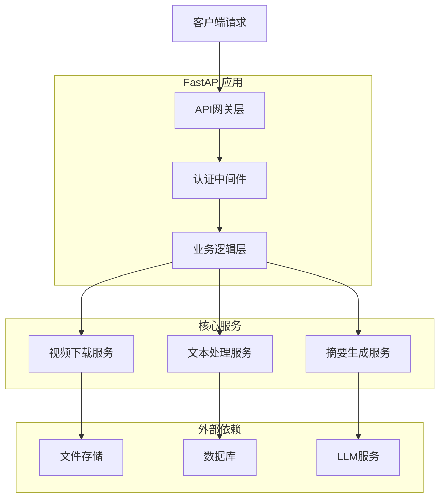
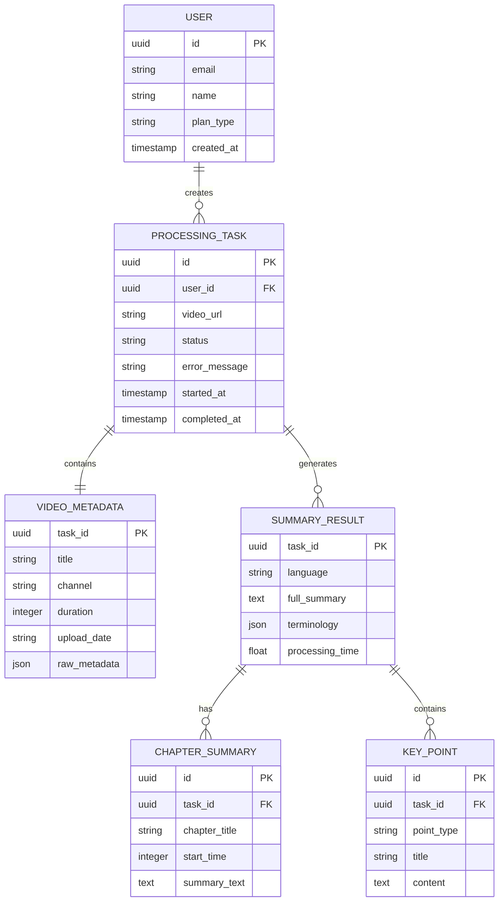

## 1. 架构设计



## 2. 技术描述

* **前端**: Next.js\@14 + TypeScript + Tailwind CSS

* **初始化工具**: create-next-app

* **后端**: Python\@3.11 + FastAPI

* **数据库**: PostgreSQL\@15 (通过Supabase提供)

* **缓存**: Redis\@7

* **语音识别**: OpenAI Whisper

* **LLM服务**: OpenAI GPT-4 Turbo

* **视频下载**: yt-dlp (youtube-dl的活跃分支)

## 3. 路由定义

| 路由                  | 用途               |
| ------------------- | ---------------- |
| /                   | 首页，视频链接输入和处理入口   |
| /summary/\[id]      | 摘要结果页，展示生成的视频摘要  |
| /history            | 历史记录页，用户过往处理记录   |
| /api/process        | 视频处理API，接收链接返回摘要 |
| /api/status/\[id]   | 处理状态查询API        |
| /api/download/\[id] | 摘要导出下载API        |

## 4. API定义

### 4.1 视频处理API

```
POST /api/process
```

请求参数：

| 参数名            | 类型      | 必需 | 描述             |
| -------------- | ------- | -- | -------------- |
| url            | string  | 是  | YouTube视频链接    |
| language       | string  | 否  | 目标语言，默认zh-CN   |
| force\_refresh | boolean | 否  | 强制重新处理，默认false |

响应参数：

| 参数名             | 类型     | 描述                                         |
| --------------- | ------ | ------------------------------------------ |
| task\_id        | string | 处理任务ID                                     |
| status          | string | 任务状态 (pending/processing/completed/failed) |
| estimated\_time | number | 预计处理时间(秒)                                  |

示例：

```json
{
  "url": "https://www.youtube.com/watch?v=dQw4w9WgXcQ",
  "language": "zh-CN"
}
```

### 4.2 摘要查询API

```
GET /api/summary/[task_id]
```

响应参数：

| 参数名           | 类型     | 描述      |
| ------------- | ------ | ------- |
| video\_title  | string | 视频标题    |
| channel\_name | string | 频道名称    |
| duration      | number | 视频时长(秒) |
| upload\_date  | string | 发布日期    |
| chapters      | array  | 章节信息数组  |
| key\_points   | array  | 关键要点数组  |
| terminology   | object | 术语解释对象  |
| summary\_text | string | 完整摘要文本  |

## 5. 服务器架构图



## 6. 数据模型

### 6.1 数据模型定义



### 6.2 数据定义语言

用户表 (users)

```sql
CREATE TABLE users (
    id UUID PRIMARY KEY DEFAULT gen_random_uuid(),
    email VARCHAR(255) UNIQUE NOT NULL,
    name VARCHAR(100) NOT NULL,
    plan_type VARCHAR(20) DEFAULT 'free' CHECK (plan_type IN ('free', 'premium', 'enterprise')),
    api_key VARCHAR(255) UNIQUE,
    created_at TIMESTAMP WITH TIME ZONE DEFAULT NOW(),
    updated_at TIMESTAMP WITH TIME ZONE DEFAULT NOW()
);

CREATE INDEX idx_users_email ON users(email);
CREATE INDEX idx_users_api_key ON users(api_key);
```

处理任务表 (processing\_tasks)

```sql
CREATE TABLE processing_tasks (
    id UUID PRIMARY KEY DEFAULT gen_random_uuid(),
    user_id UUID REFERENCES users(id),
    video_url TEXT NOT NULL,
    target_language VARCHAR(10) DEFAULT 'zh-CN',
    status VARCHAR(20) DEFAULT 'pending' CHECK (status IN ('pending', 'downloading', 'transcribing', 'summarizing', 'completed', 'failed')),
    error_message TEXT,
    started_at TIMESTAMP WITH TIME ZONE DEFAULT NOW(),
    completed_at TIMESTAMP WITH TIME ZONE,
    created_at TIMESTAMP WITH TIME ZONE DEFAULT NOW()
);

CREATE INDEX idx_processing_tasks_user_id ON processing_tasks(user_id);
CREATE INDEX idx_processing_tasks_status ON processing_tasks(status);
CREATE INDEX idx_processing_tasks_created_at ON processing_tasks(created_at DESC);
```

视频元数据表 (video\_metadata)

```sql
CREATE TABLE video_metadata (
    task_id UUID PRIMARY KEY REFERENCES processing_tasks(id),
    title TEXT NOT NULL,
    channel_name VARCHAR(255),
    duration_seconds INTEGER,
    upload_date DATE,
    view_count BIGINT,
    thumbnail_url TEXT,
    raw_metadata JSONB,
    created_at TIMESTAMP WITH TIME ZONE DEFAULT NOW()
);
```

摘要结果表 (summary\_results)

```sql
CREATE TABLE summary_results (
    task_id UUID PRIMARY KEY REFERENCES processing_tasks(id),
    language VARCHAR(10) NOT NULL,
    full_summary TEXT NOT NULL,
    terminology JSONB,
    processing_time_seconds FLOAT,
    accuracy_score FLOAT CHECK (accuracy_score >= 0 AND accuracy_score <= 1),
    created_at TIMESTAMP WITH TIME ZONE DEFAULT NOW()
);

CREATE INDEX idx_summary_results_language ON summary_results(language);
```

章节摘要表 (chapter\_summaries)

```sql
CREATE TABLE chapter_summaries (
    id UUID PRIMARY KEY DEFAULT gen_random_uuid(),
    task_id UUID REFERENCES processing_tasks(id),
    chapter_title VARCHAR(255) NOT NULL,
    start_time_seconds INTEGER,
    end_time_seconds INTEGER,
    summary_text TEXT NOT NULL,
    key_points JSONB,
    created_at TIMESTAMP WITH TIME ZONE DEFAULT NOW()
);

CREATE INDEX idx_chapter_summaries_task_id ON chapter_summaries(task_id);
```

## 7. yt-dlp能力分析

yt-dlp作为youtube-dl的活跃分支，相比原项目具有以下优势：

1. **性能优势**：下载速度更快，支持多线程下载
2. **更新频率**：维护活跃，支持最新YouTube格式
3. **字幕支持**：支持更多字幕格式和语言
4. **元数据提取**：提供更完整的视频信息
5. **格式选择**：智能选择最佳音视频质量

在本项目中，yt-dlp主要用于：

* 获取视频元数据（标题、作者、时长、缩略图等）

* 下载字幕文件（支持多种格式：srt、vtt、ass等）

* 提取音频轨道（用于无字幕情况下的语音转文字）

* 获取视频章节信息（用于结构化摘要）

